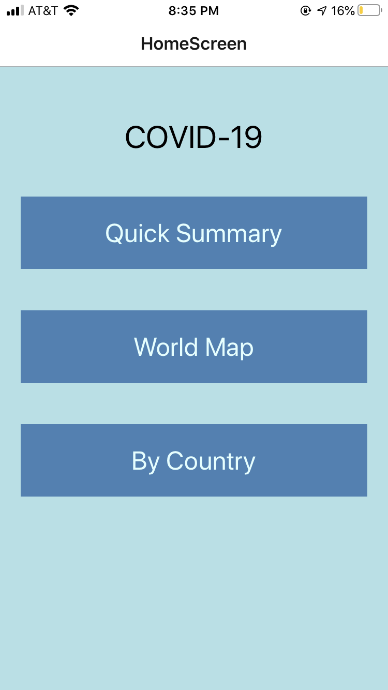
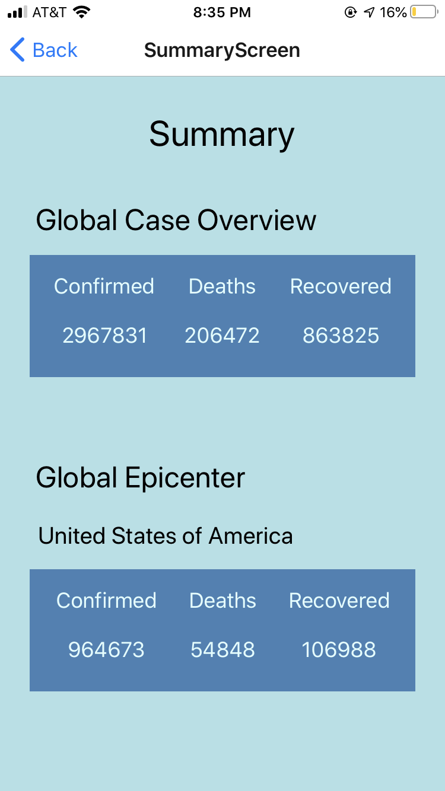
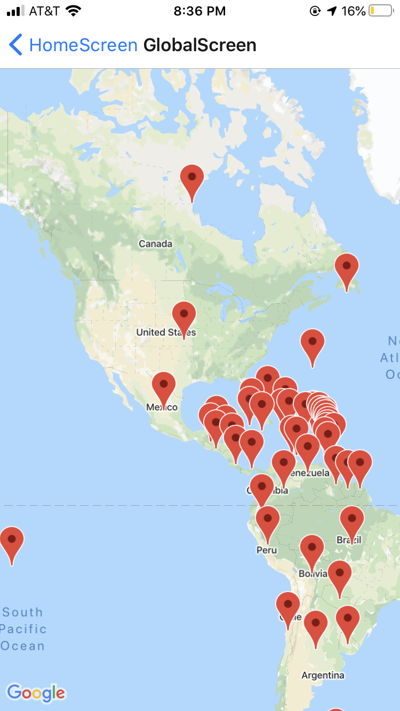
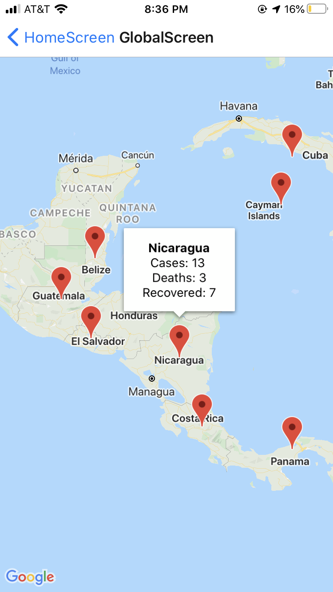
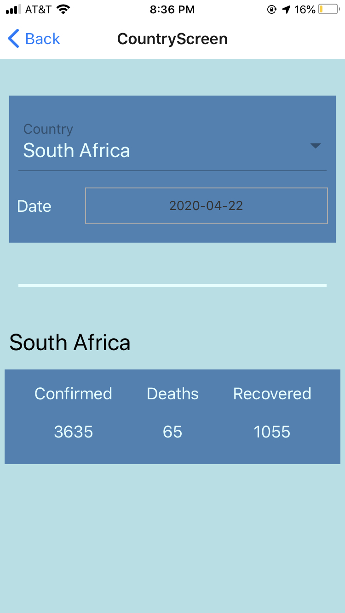
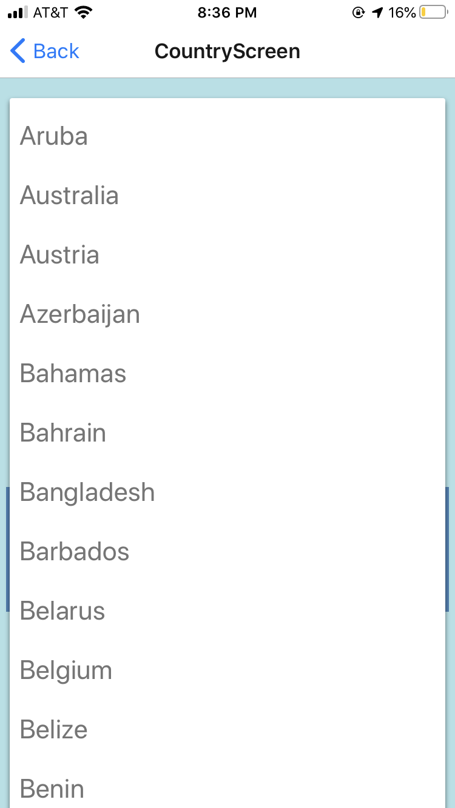
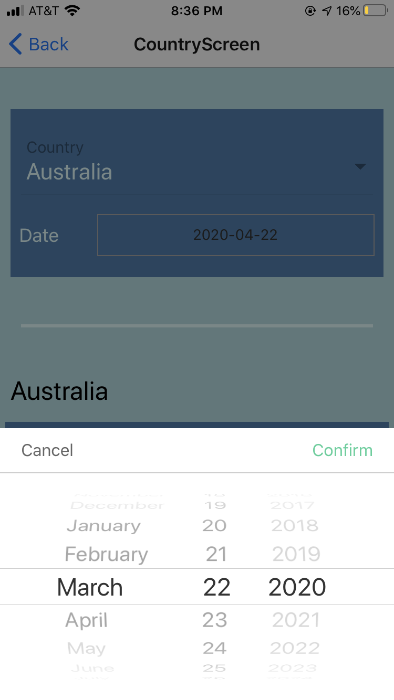
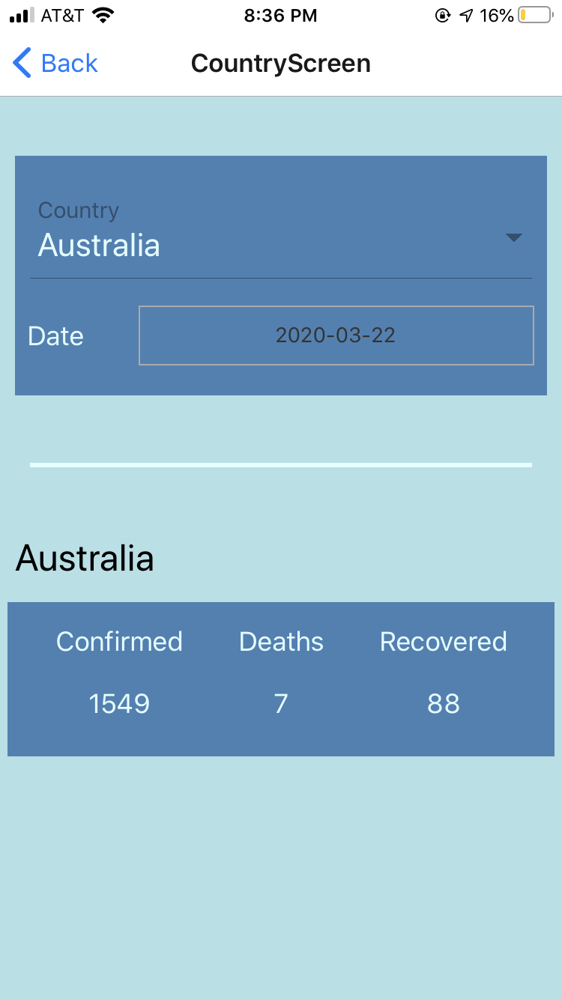

# COVID-19 React Native Application

## Screens

### Home Screen
The home screen allows navigation to all other screens.

### Quick Summary
The SummaryScreen shows the global total for Confirmed cases, Deaths, and Recovered cases. It also calculates the current gobal epicenter for the virus (based on highest number of confirmed cases). It shows the numbers for the global epicenter country as well.

### World Map
The GlobalScreen is a Google Map of the globe with markers for every country. Each marker shows the current total for confirmed, deaths, and recovered for that country.

### By Country
The CountryScreen allows the user to see information about a particular country for any date between January 22nd, 2020 and the current date. The user can select any country from the dropdown and the date from the DatePicker. It then displays the number of confirmed, deaths, and recovered for that date in that country.

